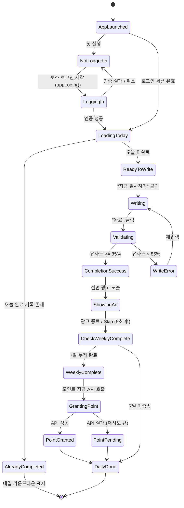
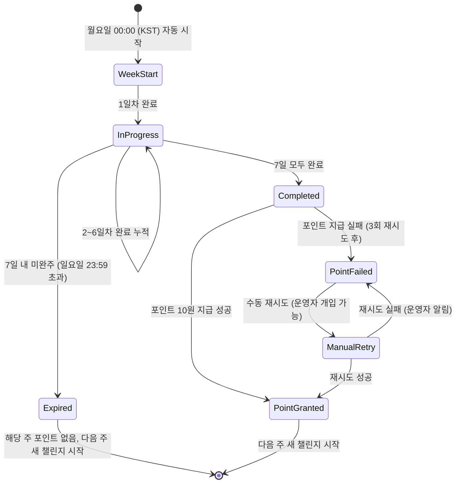
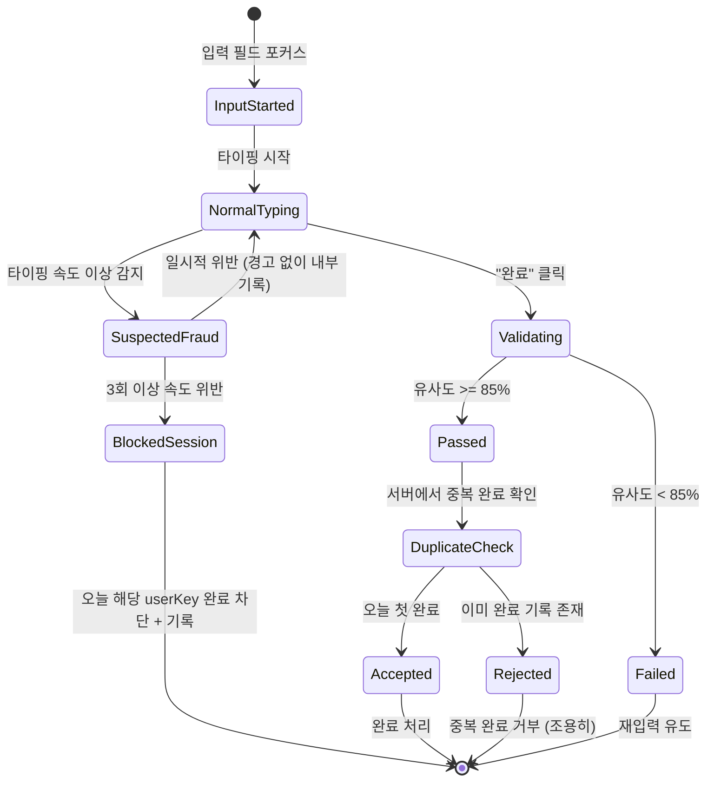
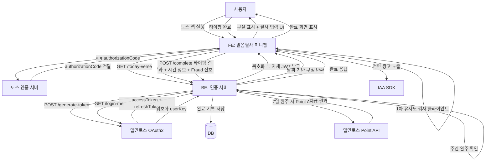

# 비즈니스 로직 정의서 — 말씀필사 (Bible-Pilsa)

> 문서 버전: v1.0
> 작성일: 2026년 3월 6일
> 작성 주체: PLANNING AGENT (STAGE 1)
> 참조 문서: `prd.md`, `feasibility-report.md`

---

## 1. 핵심 도메인 개념

### 주요 엔티티

| 엔티티 | 설명 | 주요 속성 |
|--------|------|---------|
| **User** | 토스 로그인 사용자 | `userKey` (앱인토스 고유값), `registeredAt`, `weeklyStreak`, `totalCompletions`, `totalPointsEarned` |
| **DailyVerse** | 오늘의 말씀 (날짜별 1절) | `date` (YYYY-MM-DD), `book` (책 이름), `chapter` (장), `verse` (절), `text` (개역한글판 원문) |
| **CompletionRecord** | 필사 완료 기록 | `userKey`, `date`, `verseId`, `typedText`, `similarityScore`, `completedAt`, `fingerprintHash` |
| **WeeklyChallenge** | 주간 챌린지 현황 | `userKey`, `weekStart` (월요일 기준), `completedDays` (0~7), `pointGranted` (boolean), `grantedAt` |
| **PointTransaction** | 포인트 지급 이력 | `userKey`, `weekStart`, `amount` (10원), `status` (`pending`/`completed`/`failed`), `appsInTossTransactionId` |
| **BibleVerse** | 성경 말씀 원본 데이터 | `id`, `book`, `chapter`, `verse`, `text` (개역한글판) — JSON 번들 내장 |

### 엔티티 관계

```
User (1) ────── (N) CompletionRecord
User (1) ────── (N) WeeklyChallenge
User (1) ────── (N) PointTransaction
WeeklyChallenge (1) ── (1) PointTransaction (주 1회)
DailyVerse (1) ──────── (N) CompletionRecord
BibleVerse (N) ──────── (N) DailyVerse (날짜별 1개 선정)
```

---

## 2. 상태 흐름도

### 2-1. 일일 필사 상태 흐름



### 2-2. 주간 챌린지 상태 흐름



### 2-3. Fraud 감지 상태 흐름



---

## 3. 비즈니스 규칙

### 3-1. 오늘의 말씀 선정 규칙

| 규칙 | 설명 |
|------|------|
| 선정 단위 | 1절 단위 (성경 전체 약 31,102절 중 하루 1절) |
| 선정 방식 | 서버에서 날짜(YYYY-MM-DD KST 기준) → 해시 → 성경 인덱스 매핑 (결정론적 랜덤) |
| 날짜 기준 | KST 00:00 기준 갱신. 동일 날짜에는 모든 사용자에게 동일 구절 제공 |
| 성경 범위 | 구약 + 신약 전체 (개역한글판 JSON 번들) |
| 짧은 절 보정 | 3단어 미만 절(예: 족보 목록)은 제외 목록에서 미리 필터링 |
| 출처 표기 | 모든 화면에서 "성경 번역 출처: 대한성서공회 개역한글판" 표기 필수 |

```python
# 결정론적 말씀 선정 의사코드
def get_daily_verse(date: str) -> BibleVerse:
    seed = int(hashlib.sha256(date.encode()).hexdigest(), 16)
    valid_verses = [v for v in ALL_VERSES if len(v.text.split()) >= 3]
    index = seed % len(valid_verses)
    return valid_verses[index]
```

### 3-2. 필사 유사도 검사 알고리즘

**사용 알고리즘**: Levenshtein Distance (편집 거리) 기반 유사도

**유사도 계산 공식**:
```
similarity = 1 - (levenshtein_distance(input, original) / max(len(input), len(original)))
```

**통과 기준**: `similarity >= 0.85` (85%)

**전처리 규칙** (정규화 후 비교):

| 처리 항목 | 규칙 | 예시 |
|----------|------|------|
| 공백 정규화 | 연속 공백 → 단일 공백, 앞뒤 공백 제거 | `"하나님  이"`→`"하나님 이"` |
| 구두점 제거 | `.,!?·…""''` 등 구두점 무시 | `"하나님이여,"` = `"하나님이여"` |
| 대소문자 | 한국어이므로 대소문자 구분 없음 (해당 없음) | — |
| 특수문자 | 괄호 `()[]` 내용 무시 | `"하나님(God)"` → `"하나님"` |
| 숫자 | 장절 번호 등 자동 삽입 숫자는 원문에서 제거 | — |

**오타 허용 예시**:

```
원문: "태초에 하나님이 천지를 창조하시니라"  (13자)
입력: "태초에 하나님이 천지를 창조하시니다"  (13자, 마지막 1자 다름)
편집거리: 1
유사도: 1 - (1/13) ≈ 0.923 → 통과 (92.3% >= 85%)
```

**클라이언트/서버 처리 분배**:
- 1차 검증: 클라이언트(FE) — 즉시 피드백, 85% 미달 시 재입력 유도
- 2차 검증: 서버(BE) — 완료 처리 요청 시 서버에서 재검증 (Fraud 방지 목적)
  - 서버는 클라이언트 결과를 신뢰하지 않음 (원문 텍스트는 BE에서도 보유)

### 3-3. 주간 완주 판단 기준

| 항목 | 규칙 |
|------|------|
| 주 시작 | 매주 월요일 00:00:00 KST |
| 주 종료 | 매주 일요일 23:59:59 KST |
| 완주 조건 | 해당 주 내 **7일 누적 완료** (연속이 아닌 누적 기준) |
| 포인트 지급 시점 | 7번째 완료 처리 직후 즉시 지급 시도 |
| 동일 주 중복 지급 방지 | `WeeklyChallenge.pointGranted = true`이면 재지급 차단 |
| 누적 vs 연속 판단 이유 | 연속 7일은 초보자에게 부담 → 누적 7일로 친화적 진입 장벽 설정 |

**주간 완주 조건 예시**:

```
월: 완료 ✅  화: 미완료 ⬜  수: 완료 ✅  목: 완료 ✅
금: 완료 ✅  토: 미완료 ⬜  일: 완료 ✅  → 5/7 → 미완주

월: 완료 ✅  화: 완료 ✅  수: 완료 ✅  목: 완료 ✅
금: 완료 ✅  토: 완료 ✅  일: 완료 ✅  → 7/7 → 완주 → 포인트 10원 지급
```

### 3-4. 포인트 지급 Fraud 방지 로직

#### A. 타이핑 속도 제한

| 규칙 | 임계값 | 처리 |
|------|--------|------|
| 최소 타이핑 소요 시간 | 원문 글자 수 × 0.5초 이상 | 미달 시 완료 처리 거부 (서버 판단) |
| 입력 시작 ~ 완료 버튼 클릭 최소 시간 | 10초 이상 | 10초 미만이면 서버에서 재검토 |
| 예시 (30자 구절) | 30 × 0.5 = 15초 최소 | 15초 미만이면 Fraud 의심 플래그 |

> FE에서 타이핑 시작 시각(`typingStartAt`)과 완료 요청 시각을 서버에 함께 전송.

#### B. 복사/붙여넣기 차단

```javascript
// FE 구현 의사코드
textarea.addEventListener('paste', (e) => {
  e.preventDefault();
  // 붙여넣기 시도 횟수 기록 (서버에 전송)
  fraudSignals.pasteAttempts++;
});
```

#### C. 서버 중복 완료 방지

```
BE에서 처리:
1. userKey + date 조합으로 CompletionRecord 중복 확인
2. 이미 존재하면 200 OK 반환하되 포인트 지급 없이 종료
3. 동시 요청 방지: Redis/DB 레벨 UNIQUE 제약 (userKey + date)
```

#### D. Fraud 신호 종합 평가

| 신호 | 가중치 | 설명 |
|------|--------|------|
| 타이핑 속도 위반 | 높음 | 최소 시간 미달 |
| 붙여넣기 시도 | 중간 | paste 이벤트 발생 |
| 동일 IP 다계정 | 높음 | 동일 IP에서 N개 계정 동일 시각 완료 |
| 유사도 정확히 100% | 낮음 | 단독으로는 의심 아님, 다른 신호와 복합 판단 |

**신호 2개 이상 복합 감지**: 해당 완료 처리 차단 + 내부 로그 기록 (사용자에게는 조용히 거부)

#### E. 포인트 지급 API 호출 및 재시도 정책

```
1회 시도: 즉시 호출
실패 시 1차 재시도: 30초 후
실패 시 2차 재시도: 5분 후
실패 시 3차 재시도: 30분 후
3회 모두 실패: PointTransaction.status = 'failed', 운영자 알림
→ 운영자 수동 재지급 또는 배치 작업으로 처리
```

### 3-5. 광고 노출 정책

| 항목 | 규칙 |
|------|------|
| 광고 유형 | 전면 광고 (Interstitial) — 필사 완료 직후 자동 노출 |
| 노출 빈도 | 하루 1회 (완료 시 1회) — 동일 날짜 중복 노출 없음 |
| Skip 가능 시점 | 5초 경과 후 Skip 버튼 활성화 |
| 보상형 광고 (v1.1) | 완료 화면에서 "광고 보고 추가 포인트 받기" 버튼 노출 → 사용자 선택적 시청 |
| 광고 미완료 시 | 광고 건너뛰어도 필사 완료 처리는 유지 (광고 시청이 완료 조건이 아님) |
| 광고 SDK | 앱인토스 IAA SDK 연동 (구체적 SDK는 앱인토스 광고 계약 후 확정) |

### 3-6. 개역한글판 성경 데이터 활용 방식

| 항목 | 세부 내용 |
|------|---------|
| 데이터 형식 | JSON 배열 — `{ "book": "창세기", "chapter": 1, "verse": 1, "text": "태초에..." }` |
| 저장 위치 | 앱 번들 내 정적 파일 (`/src/data/bible-kjv-1961.json`) |
| 파일 크기 | 개역한글판 전체 약 3~5MB (gzip 압축 시 ~1.5MB) — 번들 100MB 이내 여유 |
| 출처 표기 | 앱 전체 하단 "성경 번역 출처: 대한성서공회 개역한글판 (1961년판)" 상시 표기 |
| 오프라인 가용성 | 번들 내장으로 인터넷 없이도 성경 텍스트 표시 가능 |
| 데이터 소스 | GitHub 공개 데이터셋 활용 (예: `ehrudxo/kbible1950`) — 퍼블릭 도메인 확인 필수 |
| 갱신 방식 | 앱 번들 업데이트 시 교체 (성경 텍스트 자체는 불변) |

---

## 4. 외부 연동

### 4-1. 앱인토스 SDK

| 기능 | SDK / API | 버전 | 용도 |
|------|---------|------|------|
| WebView 프레임워크 | `@apps-in-toss/web-framework` | `2.0.1` | 앱인토스 미니앱 실행 환경 |
| TDS (Toss Design System) | `@toss/tds-mobile` | 최신 (`>=1.0.0`) | UI 컴포넌트 (비게임 필수) |
| 빌드 | `ait build` | SDK 2.0.1 | `.ait` 번들 생성 |

### 4-2. 토스 로그인 API

| API | Method | Endpoint | 역할 |
|-----|--------|---------|------|
| 인가 코드 취득 | SDK | `appLogin()` (FE) | 토스 로그인 창 호출 |
| AccessToken 발급 | POST | `/api-partner/v1/apps-in-toss/user/oauth2/generate-token` | authorizationCode → 토큰 교환 |
| AccessToken 갱신 | POST | `/api-partner/v1/apps-in-toss/user/oauth2/refresh-token` | refreshToken → 새 accessToken |
| 사용자 정보 조회 | GET | `/api-partner/v1/apps-in-toss/user/oauth2/login-me` | userKey 획득 (암호화 개인정보 복호화) |
| 로그인 끊기 | POST | `/api-partner/v1/apps-in-toss/user/oauth2/access/remove-by-user-key` | 회원 탈퇴 시 사용 |

**인증 흐름 요약**:
```
FE: appLogin() 호출
  → authorizationCode + referrer 수신
  → BE로 전달
BE: POST /generate-token → accessToken + refreshToken 발급
  → GET /login-me → userKey 획득 (AES-256-GCM 복호화)
  → 자체 JWT 발급하여 FE에 반환
FE: 자체 JWT를 세션 스토리지에 저장 (로컬 스토리지 금지)
```

### 4-3. 앱인토스 Point API

> 포인트 지급 API는 앱인토스와의 별도 계약 및 사업자 인증 후 엔드포인트 확정.

| 항목 | 내용 |
|------|------|
| 지급 시점 | 7일 완주 확인 직후 BE에서 호출 |
| 지급 금액 | 10원 (고정) |
| mTLS 인증 | BE ↔ 앱인토스 서버 간 양방향 인증서 설정 필수 |
| 재시도 정책 | 지수 백오프 3회 → 실패 시 운영자 알림 |
| 중복 지급 방지 | `PointTransaction` 테이블 UNIQUE(userKey, weekStart) 제약 |

### 4-4. 인앱 광고 (IAA)

| 항목 | 내용 |
|------|------|
| 광고 유형 | 전면(Interstitial) + 보상형(Rewarded, v1.1) |
| 통합 방법 | 앱인토스 IAA SDK (계약 후 확정) |
| 수익 배분 | 앱인토스 수수료 공제 후 파트너사 정산 |
| 광고 미노출 대응 | 광고 SDK 초기화 실패 시 완료 화면으로 자연스럽게 전환 (광고 없음 폴백) |

### 4-5. 자체 백엔드 (BE)

| 구성 요소 | 역할 |
|---------|------|
| 인증 서버 | 토스 OAuth2 토큰 교환 + 자체 JWT 발급 |
| 완료 처리 API | 필사 완료 기록 저장, 유사도 2차 검증, Fraud 감지 |
| 주간 챌린지 API | 주간 완료 현황 조회 + 7일 완주 판단 + 포인트 지급 트리거 |
| 포인트 지급 워커 | 앱인토스 Point API 호출 + 재시도 큐 처리 |
| 오늘의 말씀 API | 날짜 기반 결정론적 구절 반환 (성경 데이터는 서버도 보유) |

**BE_REQUIRED: true** — Fraud 방지 및 포인트 지급 신뢰성을 위해 BE 필수

---

## 5. 데이터 흐름 다이어그램



---

## 6. API 명세 (BE 인터페이스)

### 오늘의 말씀 조회

```
GET /api/v1/daily-verse
Headers: Authorization: Bearer {jwt}
Response:
{
  "date": "2026-03-06",
  "book": "요한복음",
  "chapter": 3,
  "verse": 16,
  "text": "하나님이 세상을 이처럼 사랑하사 독생자를 주셨으니..."
}
```

### 필사 완료 처리

```
POST /api/v1/complete
Headers: Authorization: Bearer {jwt}
Body:
{
  "date": "2026-03-06",
  "typedText": "하나님이 세상을 이처럼...",
  "typingDurationMs": 32000,
  "typingStartAt": "2026-03-06T06:12:30Z",
  "pasteAttempts": 0,
  "clientSimilarity": 0.94
}
Response (성공):
{
  "success": true,
  "similarity": 0.94,
  "weekProgress": { "completed": 5, "total": 7 },
  "weeklyComplete": false,
  "pointGranted": null
}
Response (7일 완주):
{
  "success": true,
  "similarity": 0.97,
  "weekProgress": { "completed": 7, "total": 7 },
  "weeklyComplete": true,
  "pointGranted": { "amount": 10, "status": "completed" }
}
Response (Fraud 감지):
{
  "success": false,
  "errorCode": "FRAUD_DETECTED",
  "message": "다시 시도해주세요."
}
```

### 주간 현황 조회

```
GET /api/v1/weekly-status
Headers: Authorization: Bearer {jwt}
Response:
{
  "weekStart": "2026-03-02",
  "weekEnd": "2026-03-08",
  "completedDays": [true, false, true, true, true, false, false],
  "completedCount": 4,
  "pointGranted": false,
  "totalCompletions": 42,
  "totalPointsEarned": 50
}
```

---

*문서 끝*
